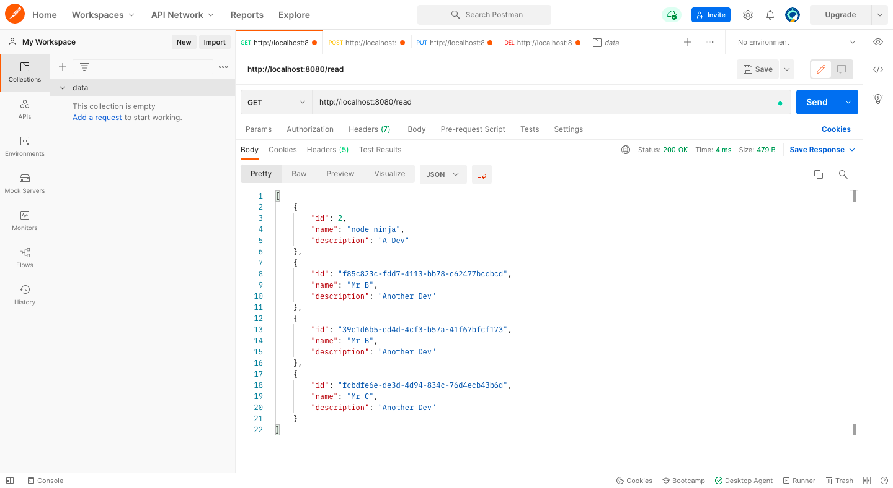

## HTTP Server - Vanilla Node REST API

> Full CRUD REST API using Node.js with no framework.

This is for learning/experimental purposes.

```
# Routes
GET      /read
POST     /create
PUT      /database/update/id
DELETE   /database/delete/id

```
> The database.json file is dynamically created along with the data directory (if the file doesn't exist before production)

## Usage

```
# Install dependencies
npm install
or
yarn add

# Run in production
npm start
or
yarn start
```



> Note: This is still under development...
